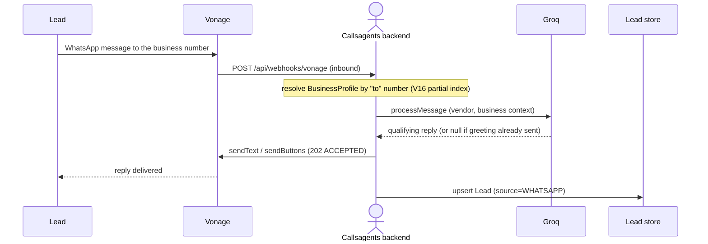
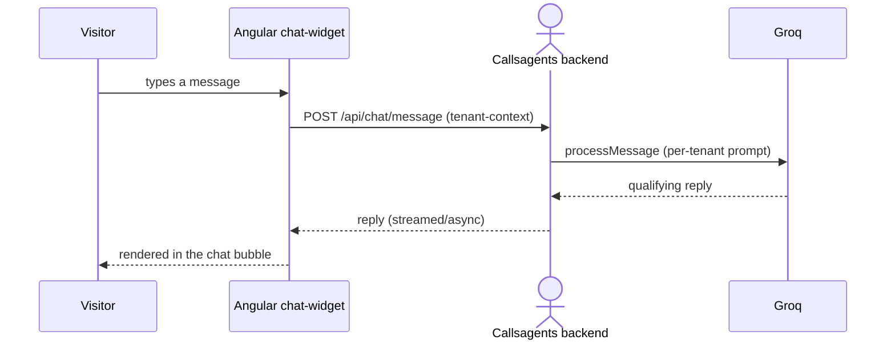
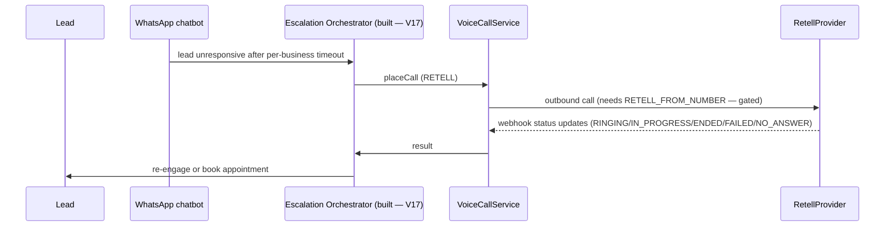

# Callsagents — Live Architecture

> Source of truth for the current SaaS architecture. Distinguishes the **LIVE SaaS core** (the product) from the **LEGACY** outbound-campaign scaffolding that is retained in-tree but deprecated. Read `00-handoff.md` for onboarding, `02-modelo-de-datos.md` for the schema, and `03-adrs.md` for the decisions behind each choice.

---

## 1. Product

Callsagents is a **multi-tenant SaaS** that captures and converts website leads through an instant **WhatsApp chatbot** and **web chat widget**, with an **AI voice call as a fallback escalation** when a lead goes silent. It is dogfooded on **Script9** (www.script-9.com); all user-facing copy says "Script9", never "Callsagents". Each client business owns a `BusinessProfile` that sets its own branding, WhatsApp number, widget, and prompt.

### Core flow

1. A visitor lands on a client site and either chats through the **web chat widget** or messages the business on **WhatsApp**.
2. An AI assistant (Groq `openai/gpt-oss-20b`) qualifies the lead in-conversation.
3. If the lead confirms a demo (`confirm_yes`), the lead is captured and — via the **Escalation Orchestrator** — a WhatsApp **follow-up** is sent.
4. If the lead does **not** reply before a per-business timeout, a **Retell AI outbound voice call** is placed as a *fallback* (never a first contact).
5. If the lead **replies** on WhatsApp, the escalation is cancelled (`RESOLVED` — no call).

## 2. Two-tier module map

### LIVE SaaS core (the product)

| Module | Responsibility |
|---|---|
| **auth** | JWT access/refresh rotation + Redis revocation, email + Google OAuth, roles. |
| **leads** | Lead CRUD, CSV import, filters, sources incl. `WHATSAPP` / `WEB_CHAT`. |
| **chat** | Web chat widget + per-tenant prompt (`BusinessPromptComposer`), ephemeral Caffeine history. |
| **whatsapp** | Vonage messaging (sendText/sendButtons/sendList) + `WhatsAppAiChatbotService` + Groq, inbound webhook routing by tenant `to` number. |
| **voice** | `VoiceCallService` + `VoiceProvider` abstraction (Retell/Vapi), WebRTC web-call, webhooks. |
| **escalation** | Escalation Orchestrator (V17): WhatsApp follow-up → timeout → Retell outbound voice, per-business config. |
| **business** | `BusinessProfile` (SaaS tenancy anchor, `@MapsId` 1:1 with User) + widget-config. |

### LEGACY (kept in-tree, deprecated — recording tables only)

`campaigns`, `campaign_leads`, `calls` (legacy outbound), `appointments` (+ calendar hook), `calendar_integrations`, `integrations`, `users`, `dashboard`, `audit`. Reference for the SaaS design; **do not extend for product work** (ADR-010).

## 3. Request flow diagrams

### 3.1 WhatsApp inbound flow (LIVE)

### 3.2 Web chat widget flow (LIVE)

### 3.3 Voice escalation flow (IMPLEMENTED + E2E-verified — Escalation Orchestrator)

Implemented and verified end-to-end (real Vonage sandbox + tunnel). A lead that **replies** on WhatsApp stops the escalation (`handleReply` → `RESOLVED`); only a qualified lead that never replies after a follow-up is escalated to voice (fallback-only, never first contact). See `17-escalation-runbook.md` for the verified matrix and the outbound-voice activation steps.

## 4. Endpoints inventory (context path `/api` — global)

| Endpoint | Method | Module | Auth |
|---|---|---|---|
| `/api/health` | GET | common | public |
| `/api/auth/login` `/api/auth/refresh` `/api/auth/logout` `/api/auth/me` | POST/POST/POST/GET | auth | public / bearer |
| `/api/auth/google` | POST | auth | public |
| `/api/leads` | GET/POST | leads | bearer |
| `/api/leads/import` | POST | leads | bearer |
| `/api/leads/{id}` | GET/PUT/DELETE | leads | bearer |
| `/api/chat/message` (+ history) | POST | chat | public (tenant) |
| `/api/webhooks/vonage` | POST | whatsapp | signature |
| `/api/webhooks/vonage/status` | POST | whatsapp | signature |
| `/api/voice/web-call` | POST | voice | bearer |
| `/api/voice/webhook/{provider}` | POST | voice | fail-closed signature |
| `/api/voice/calls` | GET | voice | bearer |
| `/api/escalation/config` | GET/PUT | escalation | ADMIN/SUPERVISOR |
| `/api/escalation/leads/{leadId}` | GET | escalation | bearer |
| `/api/escalation/{id}/cancel` | POST | escalation | ADMIN/SUPERVISOR |
| `/api/business/profile` & `/api/business/widget-config` | GET/PUT | business | bearer |
| `/api/appointments` `/api/campaigns` `/api/calls` `/api/users` `/api/dashboard/summary` `/api/integrations/voice` | — | LEGACY | (deprecated) |

Response envelope for the SaaS core: `{ "success": true, "data": ... }`.

## 5. Auth / security architecture

- **JWT HS256** via nimbus-jose-jwt: **access 15 min**, **refresh 7 d** with **rotation**.
- **Redis** revocation: `refresh:` / `revoked:` keys; **reuse detection revokes the whole session**.
- Passwords hashed with BCrypt (`BCryptPasswordEncoder(10)`).
- Google OAuth popup works via nginx **COOP/COEP: unsafe-none** (ADR-008).
- Route-level `@PreAuthorize` on SaaS endpoints; voice webhooks use **fail-closed** signature validation.
- `/auth/me` reads `Authentication.getName()` (principal is a String, not `UserDetails`).

## 6. Data storage

- **PostgreSQL 16** with native ENUMs + JSONB (`hypersistence-utils`); UUID PKs, `TIMESTAMPTZ`, hard delete + `AuditLog`.
- **Redis 7** for auth revocation state.
- **Caffeine** for ephemeral chat history (max 20 turns) — no chat table.
- Flyway migrations V1–V16 (V13 missing by design; V2 dev-only under `db/migration/dev`), fully listed in `docs/02-modelo-de-datos.md`.
- **Windows host note**: docker Postgres is on **5433:5432** (native PG owns 5432).

## 7. Codebase conventions

- **Backend (Java 21 / Spring Boot 3.5)**: standalone single-class files, Lombok entities, DTO records, microservices-style per-module packages under `com.callsagents.backend`. ORM ENUMs must use `@Enumerated(STRING) + @JdbcTypeCode(SqlTypes.NAMED_ENUM)`. Tests: Mockito + JUnit 5, `@ExtendWith(MockitoExtension.class)`, naming `{Method}_when{State}_then{Expected}` (214 tests / 22 classes).
- **Frontend (Angular 18.2)**: standalone components, signals, `inject()`, `OnPush`, native `<dialog>`, lazy routes, CSS variables (no Material/Tailwind).
- **Git**: conventional commits (`feat(scope):`, `fix(scope):`, `docs:`, `chore:`); one commit per logical change; RDD review gate before commit/push.
- Migrations: never edit a shipped migration; add `V{n}__...sql`.

## 8. Legacy vs live — a note to future readers

The repo contains a complete outbound-campaigns MVP (leads/campaigns/calls/appointments, ADMIN/SUPERVISOR/AGENT roles) that the product **pivoted away from**. It stays in-tree as reference (ADR-010) but is **not the product**; Twilio was fully removed 2026-08-29. All new behavior builds on the SaaS core (auth, leads, chat, whatsapp, voice, business, escalation). When extending, prefer the SaaS path and update this document's module table and endpoints inventory.
